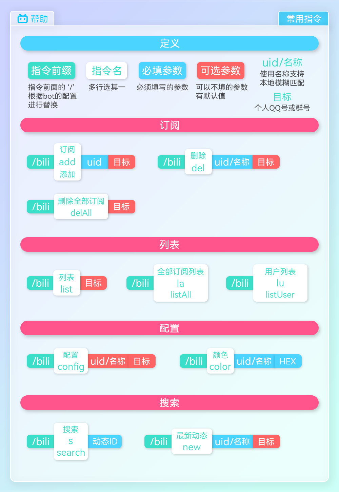

# BilibiliDynamic MiraiPlugin

一个可低延迟检测 B 站动态/直播并转发到 Q 群的 [Mirai](https://github.com/mamoe/mirai) 插件    

[](https://mirai.mamoe.net/topic/792)


[](https://github.com/Colter23/bilibili-dynamic-mirai-plugin/releases)

## 特性
**无论多少订阅均可在最低 10s 内检测所有动态**  
使用 [skiko](https://github.com/JetBrains/skiko) 绘图   
动态过滤     
扫码登录   
可配置性高

## V3版本
v3需 `>= mirai 2.12.0`    
v3完全重构, 使用 [skiko](https://github.com/JetBrains/skiko) 绘图, 更加美观。同时增加稳定性与可配置性    
[v2版本](https://github.com/Colter23/bilibili-dynamic-mirai-plugin/tree/v2)

建了个QQ群，有问题可即时反馈 [734922374](https://jq.qq.com/?_wv=1027&k=NuSQdKTQ)

Vtuber 字幕组及粉丝群如需要使用可通过群联系我, 使用我搭建的bot实例

## V3样式预览
    
    


## 安装
### 前置
前置插件: [**mirai-skia-plugin**](https://github.com/cssxsh/mirai-skia-plugin)   
插件命令依赖: [**chat-command**](https://github.com/project-mirai/chat-command)  

### 手动下载jar包 (与下面二选一)   
插件本体: [**releases**](https://github.com/Colter23/bilibili-dynamic-mirai-plugin/releases)

### MCL 指令安装 (与上面二选一)
中央仓库会延迟几个小时   
`./mcl --update-package top.colter:bilibili-dynamic-mirai-plugin --channel maven --type plugin`

## 指令

常用指令帮助图   
可通过 `/bili help` 指令获取    
如果你对这张图有什么建议也可以反馈    


| 订阅相关                                  | 描述                  |
|---------------------------------------|---------------------|
| `/bili <h / help / menu / 帮助>`        | 获取上面的帮助图片           |
| `/bili <login / 登录>`                  | 扫码登录 (需在配置文件中配置管理员) |
| `/bili <add / 添加 / 订阅> <uid> [群/Q号]`  | 为目标 [群/Q号] 添加一个订阅   |
| `/bili <del / 删除> <uid / 用户名> [群/Q号]` | 为目标 [群/Q号] 删除一个订阅   |
| `/bili <delAll / 删除全部订阅> [群/Q号]`      | 将目标 [群/Q号] 的全部订阅删除  |

| 订阅列表                            | 描述                      |
|---------------------------------|-------------------------|
| `/bili <list / 列表> [群/Q号]`      | 查询目标 [群/Q号] 的订阅列表       |
| `/bili <listAll / la / 全部订阅列表>` | 查询全部订阅列表 (需在配置文件中配置管理员) |
| `/bili <listUser / lu / 用户列表>`  | 查询用户列表  (需在配置文件中配置管理员)  |

| 配置                                                        | 描述                                                                                                                                                                                            |
|-----------------------------------------------------------|-----------------------------------------------------------------------------------------------------------------------------------------------------------------------------------------------|
| `/bili <config / 配置> [uid / 用户名] [群/Q号]`                  | 交互式配置 (可配置主题色 模板 过滤器)                                                                                                                                                                         |
| `/bili <color / 颜色> <uid / 用户名> <HEX颜色>`                  | 为目标 UID 设置图片推送主题色                                                                                                                                                                             |
| `/bili <templateList / tl / 模板列表>`                        | 查看推送模板推送效果                                                                                                                                                                                    |
| `/bili <template / t / 模板> <模板类型> <模板名> [群/Q号]`           | 设置模板 <br/>模板类型: `d`(动态模板)  `l`(直播模板)                                                                                                                                                          |
| `/bili <atall / aa / at全体> [类型] [uid / 用户名] [群/Q号]`       | 设置At全体  可加多个  类型: <br/> `全部 / all / a` : 动态与直播 <br/> `全部动态 / dynamic / d` : 全部动态 <br/> `直播 / live / l` : 直播 <br/> `视频 / video / v` : 视频 <br/> `音乐 / music / m` : 音乐 <br/> `专栏 / article` : 专栏 |
| `/bili <delAtall / daa / 取消at全体> [类型] [uid / 用户名] [群/Q号]` | 取消一个At全体项                                                                                                                                                                                     |
| `/bili <listAtall / laa / at全体列表> [uid / 用户名] [群/Q号]`     | 查看At全体项列表                                                                                                                                                                                     |

| 搜索指令                                  | 描述                     |
|---------------------------------------|------------------------|
| `/bili <search / s / 搜索> <动态ID>`      | 通过ID搜索一个动态             |
| `/bili <new / 最新动态> <uid / 用户名> [数量]` | 获取用户最新动态 (支持用户名本地模糊搜索) |

推荐使用 `config` 指令配置 模板 过滤器

扫码登录请在配置文件中填写管理员账号    
`<..>` 尖括号为必填参数   `[..]` 中括号为可选参数    
`[群/Q号]` 不填的话默认对话所在地    
`<HEX颜色>` 必须带#号 支持多个值自定义渐变 中间用分号‘;’分隔 例: #fde8ed;#fde8ed    
单个值会自动生成渐变色    
`uid / 用户名` 使用名称可以`本地`模糊匹配（只有订阅过才能匹配）

```
# 栗子
/bili add 487550002             #为当前群/好友添加 uid 为 487550002 的订阅
/bili add 487550002 111111      #为 111111 群/好友添加订阅
/bili color 487550002 #fde8ed   #设置主题色
/bili t d ForwardMsg            #为当前群/好友动态推送模板设置为ForwardMsg
```

### 动态过滤指令
推荐使用 `/bili config` 交互式配置

两种过滤器:
- 类型过滤器: 通过动态类型进行过滤 可选类型 `动态` `转发动态` `视频` `音乐` `专栏` `直播`
- 内容正则过滤器: 对动态进行正则匹配过滤    
可同时添加两种过滤器，但两种过滤器是独立先后执行的   

过滤器的两种模式:
- `黑名单`：当动态匹配过滤器时**不**推送动态
- `白名单`：仅当动态匹配过滤器时**推送**动态

过滤器模式黑名单模式

| 指令                                                            | 描述                                                                          |
|---------------------------------------------------------------|-----------------------------------------------------------------------------|
| `/bili <filterType / ft / 类型过滤> <类型> [uid] [群/Q号]`            | 为目标 [群/Q号] 添加 uid 的动态类型过滤器                                                  |
| `/bili <filterReg / fr / 正则过滤> <正则表达式> [uid] [群/Q号]`          | 为目标 [群/Q号] 添加 uid 的动态正则过滤器                                                  |
| `/bili <filterMode / fm / 过滤模式> <过滤器类型> <过滤器模式> [uid] [群/Q号]` | 切换过滤器模式 <br/>过滤器类型: `t`(类型过滤器) `r`(正则过滤器) <br/>过滤器模式: `w`(白名单模式) `b`(黑名单模式) |
| `/bili <filterList / fl / 过滤列表> [uid] [群/Q号]`                 | 列出 uid 的过滤器列表                                                               |
| `/bili <filterDel / fd / 过滤删除> <index> [uid] [群/Q号]`          | 删除 uid 中 index 的过滤器                                                         |

```
# 栗子
/bili ft 转发动态 487550002    # 为当前群/好友订阅的 487550002 设置类型为“转发动态”的过滤
# 当 487550002 用户动态类型为“转发动态”时触发过滤器(是否推送要看过滤器模式)

/bili fr ^新年好 0 111111    # 为 111111 群/好友订阅的所有用户设置内容为“^新年好”的包含
# 当 111111 群/好友订阅的所有用户的动态内容开头包含“新年好”时触发过滤器(是否推送要看过滤器模式)

/bili fl 487550002   # 查询当前群/好友订阅的 487550002 设置过的过滤列表
# 当前目标过滤器: 
#
# 动态类型过滤器: 
#  模式: 黑名单
#  t0: 转发动态
#  t1: 视频
# 正则过滤器: 
#  模式: 黑名单
#  r0: 转发抽奖
#
# t0 t1 r0 等为删除的索引<index>

/bili fd t1 487550002   # 删除上面t1的过滤

# 特例
# uid 为 0 时，代表群/好友订阅的所有用户
# 不填默认也为 0
```

## 权限
插件命令依赖 [chat-command](https://github.com/project-mirai/chat-command) 来正确处理聊天环境下的命令，请确保有此插件，否则插件可能无法正常工作

| 权限名        | ID                                                    |
|------------|-------------------------------------------------------|
| 基础权限ID     | top.colter.bilibili-dynamic-mirai-plugin:*            |
| 动态指令ID     | top.colter.bilibili-dynamic-mirai-plugin:command.bili |
| **跨通讯录控制** | top.colter.bilibili-dynamic-mirai-plugin:crossContact |

跨通讯录控制可以让你修改查看别人的配置

如果你不会给权限可以点击下面展开查看简略教程
<details>
<summary>点击展开</summary>

在控制台输入 `/perm add <许可人 ID> top.colter.bilibili-dynamic-mirai-plugin:command.bili`

其中的 `许可人 ID` 如果你要让所有群所有人都可以用此插件就是 `*` 即 `/perm add * top.colter.bilibili-dynamic-mirai-plugin:command.bili`    
具体的用户: `u123456789` 全部用户: `u*`    
具体的群: `g123456789` 全部群: `g*`    
更多的配置见 [被许可人 ID 字符串表示](https://github.com/mamoe/mirai-console/blob/master/docs/Permissions.md#%E5%AD%97%E7%AC%A6%E4%B8%B2%E8%A1%A8%E7%A4%BA)    
[授予一个用户执行所有指令的权限](https://github.com/mamoe/mirai-console/blob/master/docs/BuiltInCommands.md#%E6%8E%88%E4%BA%88%E4%B8%80%E4%B8%AA%E7%94%A8%E6%88%B7%E6%89%A7%E8%A1%8C%E6%89%80%E6%9C%89%E6%8C%87%E4%BB%A4%E7%9A%84%E6%9D%83%E9%99%90)

</details>

#### ~~At全体权限~~
**3.0.0-BETA4 后废弃**   
废弃后仍可使用, 但不推荐, 推荐使用前面的指令进行配置

| 权限名   | ID                                                     |
|-------|--------------------------------------------------------|
| 直播@全体 | `top.colter.bilibili-dynamic-mirai-plugin:live.atall`  |
| 视频@全体 | `top.colter.bilibili-dynamic-mirai-plugin:video.atall` |


## 配置
配置文件位于 `mirai 根目录/config/top.colter.bilibili-dynamic-mirai-plugin/`  
基础配置文件 `BiliConfig.yml`  
图片分辨率配置 `ImageQuality.yml`   
图片主题配置 `ImageTheme.yml`  
分辨率与主题配置已经内置了多套数据

### BiliConfig.yml
| 配置项               | 取值                                       | 说明   |
|-------------------|------------------------------------------|------|
| `admin`           | QQ号 / 群号                                 | 管理员  |
| `enableConfig`    | [EnableConfig](#EnableConfig)            | 功能开关 |
| `accountConfig`   | [BiliAccountConfig](#BiliAccountConfig)  | 账号配置 |
| `checkConfig`     | [CheckConfig](#CheckConfig)              | 检测配置 |
| `pushConfig`      | [PushConfig](#PushConfig)                | 推送配置 |
| `imageConfig`     | [ImageConfig](#ImageConfig)              | 绘图配置 |
| `templateConfig`  | [TemplateConfig](#TemplateConfig)        | 模板配置 |
| `cacheConfig`     | [CacheConfig](#CacheConfig)              | 缓存配置 |
| `proxyConfig`     | [ProxyConfig](#ProxyConfig)              | 代理配置 |
| `translateConfig` | [TranslateConfig](#TranslateConfig)      | 翻译配置 |

---------------------

#### EnableConfig
| 配置项                | 取值               | 说明     |
|--------------------|------------------|--------|
| `drawEnable`       | `true` / `false` | 绘图开关   |
| `notifyEnable`     | `true` / `false` | 操作通知开关 |
| `lowSpeedEnable`   | `true` / `false` | 低频检测开关 |
| `translateEnable`  | `true` / `false` | 翻译开关   |
| `proxyEnable`      | `true` / `false` | 代理开关   |
| `cacheClearEnable` | `true` / `false` | 缓存清理开关 |

#### BiliAccountConfig
| 配置项           | 取值                            | 说明       |
|---------------|-------------------------------|----------|
| `cookie`      | SESSDATA=xxxx; bili_jct=xxxx; | B站Cookie |
| `autoFollow`  | `true` / `false`              | 自动关注     |
| `followGroup` | 最长16字符                        | 关注时保存的分组 |

#### CheckConfig
| 配置项                   | 取值                         | 说明                                      |
|-----------------------|----------------------------|-----------------------------------------|
| `interval`            | 推荐 15-60 单位秒               | 动态检测间隔                                  |
| `liveInterval`        | 单位秒                        | 直播检测间隔                                  |
| `lowSpeed`            | 例: 3-8x2 三点到八点检测间隔为正常间隔的2倍 | 低频检测时间段与倍率                              |
| `checkReportInterval` | 单位分 为 0 时代表每次检测都汇报         | 检测报报间隔 (在debug里打印) 报告中最后的数代表在间隔内进行了几次检测 |

#### PushConfig
| 配置项               | 取值                                               | 说明                  |
|-------------------|--------------------------------------------------|---------------------|
| `messageInterval` | 单位毫秒                                             | QQ中同一个群中连续发送多个消息的间隔 |
| `pushInterval`    | 单位毫秒                                             | QQ中连续发送多个群之间的间隔     |
| `atAllPlus`       | `SINGLE_MESSAGE`: 单独的消息  `PLUS_END`: 追加到最后一条消息后面 | At全体拼接方式            |

#### ImageConfig
| 配置项              | 取值                                                        | 说明                                                 |
|------------------|-----------------------------------------------------------|----------------------------------------------------|
| `quality`        | `800w` / `1000w` / `1200w` / `1500w` (图片宽度)               | 图片质量(分辨率)                                          |
| `theme`          | `v3` (新版绘图主题) / `v3RainbowOutline` (彩虹边框) / `v2` (旧版绘图主题) | 绘图主题 (目前两套其实都差不多，鸡肋功能)                             |
| `font`           | 字体名 / 字体文件名(不用加后缀)                                        | 绘图字体 目前仅支持单字体 字体放到插件数据路径下 `font` 文件夹中 -> [字体](#字体) |
| `defaultColor`   | HEX颜色值 (#d3edfa;#fde8ed)                                  | 默认绘图主题色 支持多个值自定义渐变 中间用分号`;`号分隔 单个值会自动生成渐变色         |
| `cardOrnament`   | `FanCard` (粉丝卡片) / `QrCode` (动态链接二维码) / `None` (无)        | 卡片装饰                                               |
| `colorGenerator` | [ColorGenerator](#ColorGenerator)                         | 渐变色生成器配置 (用于图片背景) 仅当主题色为单个值时会自动生成                  |
| `badgeEnable`    | `true` / `false`                                          | 卡片顶部的标签                                            |

##### ColorGenerator
| 配置项          | 取值               | 说明                |
|--------------|------------------|-------------------|
| `hueStep`    | `0` ~ `120`      | 渐变色H(色相)步长 (默认三步) |
| `lockSB`     | `true` / `false` | 锁定 S(饱和度) B(亮度)   |
| `saturation` | `0.0` ~ `1.0`    | 锁定的饱和度            |
| `brightness` | `0.0` ~ `1.0`    | 锁定的亮度             |

#### TemplateConfig
| 配置项                  | 取值                                | 说明       |
|----------------------|-----------------------------------|----------|
| `defaultDynamicPush` | 下方动态推送模板名                         | 默认动态推送模板 |
| `defaultLivePush`    | 下方直播推送模板名                         | 默认直播推送模板 |
| `dynamicPush`        | [动态模板配置项](#动态模板配置项)               | 动态推送模板   |
| `livePush`           | [直播模板配置项](#直播模板配置项)               | 默认绘图主题色  |
| `forwardCard`        | [ForwardDisplay](#ForwardDisplay) | QQ转发卡片外观 |
| `footer`             | [FooterConfig](#FooterConfig)     | 绘制图片页脚模板 |

##### ForwardDisplay
| 配置项       | 取值                  | 说明                     |
|-----------|---------------------|------------------------|
| `title`   | [转发卡片配置项](#转发卡片配置项) | 转发卡片标题                 |
| `preview` | [转发卡片配置项](#转发卡片配置项) | 中间的预览，最多4行行之间用 `\n` 隔开 |
| `summary` | [转发卡片配置项](#转发卡片配置项) | 转发卡片最下边的总结             |
| `brief`   | [转发卡片配置项](#转发卡片配置项) | 从群外看显示的文字              |

##### FooterConfig
| 配置项             | 取值                          | 说明   |
|-----------------|-----------------------------|------|
| `dynamicFooter` | [页脚配置项](#页脚配置项)             | 动态页脚 |
| `liveFooter`    | [页脚配置项](#页脚配置项)             | 直播页脚 |
| `footerAlign`   | `LEFT` / `CENTER` / `RIGHT` | 对其方式 |

##### 动态模板配置项
`{draw}`: 绘制的动态图  
`{name}`: 名称  
`{uid}`: 用户ID
`{did}`: 动态ID
`{type}`: 动态类型  
`{time}`: 时间  
`{content}`: 动态内容  
`{images}`: 动态中的图  
`{link}`: 动态链接  
`{links}`: 视频专栏等有多个链接  
`\n`: 换行  
`\r`: 分割对话(会生成多个QQ消息)  
`{>>} {<<}`: 包装成转发消息  

栗子: {draw}{>>}作者：{name}\nUID：{uid}\n时间：{time}\n类型：{type}\n链接：{link}\r{content}\r{images}{<<}

##### 直播模板配置项
`{draw}`: 绘制的直播图  
`{name}`: 名称  
`{uid}`: 用户ID
`{rid}`: 房间号
`{time}`: 直播开始时间  
`{title}`: 直播标题  
`{area}`: 直播分区  
`{cover}`: 直播封面  
`{link}`: 直播链接  
`\n`: 换行  
`\r`: 分割对话(会生成多个QQ消息)  

注: 直播模板不支持 ({>>}{<<}) 转发消息

##### 转发卡片配置项
`{name}`: 名称  
`{uid}`: 用户ID  
`{did}`: 动态ID  
`{type}`: 动态类型  
`{time}`: 时间  
`{content}`: 动态内容  
`{link}`: 链接  

##### 页脚配置项
`{name}`: 名称  
`{uid}`: 用户ID  
`{id}`: 动态/直播ID  
`{type}`: 类型   
`{time}`: 时间  


#### CacheConfig
| 配置项       | 取值                                                                                                                                       | 说明                             |
|-----------|------------------------------------------------------------------------------------------------------------------------------------------|--------------------------------|
| `expires` | 单位`天`  为 `0` 时表示不清理此类图片<br/>`DRAW`: 由插件绘制的图片<br/>`IMAGES`: 动态图和封面等<br/>`EMOJI`: B站的Emoji<br/>`USER`: 用户头像,头像挂件,粉丝卡片套装等<br/>`OTHER`: 其他图片 | 图片过期时长, 当图片在指定时间内未被再次使用, 就会被删除 |

#### ProxyConfig
| 配置项     | 取值    | 说明   |
|---------|-------|------|
| `proxy` | 代理服务器 | 代理列表 |

#### TranslateConfig
| 配置项       | 取值                      | 说明                                   |
|-----------|-------------------------|--------------------------------------|
| `cutLine` | 例如: `\n\n〓〓〓 翻译 〓〓〓\n`  | 正文与翻译的分割线                            |
| `baidu`   | `APP_ID` `SECURITY_KEY` | 百度翻译密钥配置 https://api.fanyi.baidu.com |

#### `BiliConfig.yml` 配置文件模板
<details>
<summary>点击展开</summary>

```yml

# 功能开关:
#   drawEnable: 绘图开关
#   notifyEnable: 操作通知开关
#   lowSpeedEnable: 低频检测开关
#   translateEnable: 翻译开关
#   proxyEnable: 代理开关
#   cacheClearEnable: 缓存清理开关
enableConfig:
  drawEnable: true
  notifyEnable: true
  lowSpeedEnable: false
  translateEnable: false
  proxyEnable: false
  cacheClearEnable: true
  
# 账号配置:
#   cookie: BiliBili的cookie, 可使用 /bili login 自动获取
#   autoFollow: 添加订阅时是否允许 bot 自动关注未关注的用户
#   followGroup: Bot 关注时保存的分组(最长16字符)
accountConfig:
  cookie: SESSDATA=xxxx; bili_jct=xxxx;
  autoFollow: true
  followGroup: Bot关注
  
# 检测配置:
#   interval: 动态检测间隔(推荐 15-30) 单位秒
#   liveInterval: 直播检测间隔(与动态检测独立) 单位秒
#   lowSpeed: 低频检测时间段与倍率(例: 3-8x2 三点到八点检测间隔为正常间隔的2倍) 24小时制
#   checkReportInterval: 检测报告间隔 单位分
checkConfig:
  interval: 15
  liveInterval: 20
  lowSpeed: '0-0x2'
  checkReportInterval: 10
  
# 推送配置:
#   messageInterval: QQ中同一个群中连续发送多个消息的间隔 单位毫秒
#   pushInterval: QQ中连续发送多个群之间的间隔 单位毫秒
#   atAllPlus: At全体拼接方式 SINGLE_MESSAGE: 单独的消息  PLUS_END: 追加到最后一条消息后面
pushConfig:
  messageInterval: 100
  pushInterval: 500
  atAllPlus: PLUS_END

# 图片配置:
# 当 ImageQuality.yml / ImageTheme.yml 中的 customOverload 开启后下面对应的配置将不再生效
#   quality: 图片质量(分辨率), 内置 800w: 800px, 1000w: 1000px, 1200w: 1200px, 1500w: 1500px(图片宽度)
#   theme: 绘图主题, 内置 v3: 新版绘图主题, v2: 旧版绘图主题
#   font: 绘图字体 字体名或字体文件名(不用加后缀) 目前仅支持单字体 字体放到插件数据路径下 `font` 文件夹中
#   defaultColor: 默认绘图主题色 支持多个值自定义渐变 中间用分号`;`号分隔 单个值会自动生成渐变色
#   cardOrnament: 卡片装饰 FanCard(粉丝卡片)  QrCode(动态链接二维码)  None(无)
#   colorGenerator: 渐变色生成器配置 
#   badgeEnable: 卡片顶部的标签 左边右边是否开启
imageConfig:
  quality: 1000w
  theme: v3
  font: HarmonyOS_Sans_SC_Medium
  defaultColor: '#d3edfa'
  cardOrnament: FanCard
  colorGenerator:
    hueStep: 30
    lockSB: true
    saturation: 0.3
    brightness: 1.0
  badgeEnable:
    left: true
    right: false

# 模板配置:
#   defaultDynamicPush: 默认使用的推送模板, 填写下方动态模板名
#   dynamicPush: 动态推送模板
#   livePush: 直播推送模板
#   forwardCard: 转发卡片模板
#   footer: 图片页脚
templateConfig:
  defaultDynamicPush: OneMsg
  defaultLivePush: OneMsg
  dynamicPush:
    DrawOnly: '{draw}'
    TextOnly: "{name}@{type}\n{link}\n{content}\n{images}"
    OneMsg: "{draw}\n{name}@{type}\n{link}"
    TwoMsg: "{draw}\r{name}@{uid}@{type}\n{time}\n{link}"
    ForwardMsg: "{draw}{>>}作者：{name}\nUID：{uid}\n时间：{time}\n类型：{type}\n链接：{links}\r{content}\r{images}{<<}"
  livePush:
    DrawOnly: '{draw}'
    TextOnly: "{name}@直播\n{link}\n标题: {title}"
    OneMsg: "{draw}\n{name}@直播\n{link}"
    TwoMsg: "{draw}\r{name}@{uid}@直播\n{title}\n{time}\n{link}"
  forwardCard:
    title: '{name} {type} 详情'
    summary: 'ID: {did}'
    brief: '[{name} {type}]'
    preview: "时间: {time}\n{content}"
  footer:
    dynamicFooter: @Colter
    liveFooter: @Colter
    footerAlign: CENTER

# 缓存配置:
#   expires: 图片过期时长 单位天
#   为 0 时表示不清理此类图片
#   当图片在指定时间内未被再次使用,就会被删除
#   可选类型:
#     DRAW: 由插件绘制的图片
#     IMAGES: 动态图和封面等
#     EMOJI: B站的Emoji
#     USER: 用户头像,头像挂件,粉丝卡片套装等
#     OTHER: 其他图片
cacheConfig:
  expires:
    DRAW: 7
    IMAGES: 7
    EMOJI: 7
    USER: 7
    OTHER: 7

# 代理配置:
#   proxy: 代理列表
proxyConfig:
  proxy: []

# 翻译配置:
#   cutLine: 正文与翻译的分割线
#   baidu: 百度翻译 API 密钥 https://api.fanyi.baidu.com
translateConfig:
  cutLine: "\n\n〓〓〓 翻译 〓〓〓\n"
  baidu:
    APP_ID: ''
    SECURITY_KEY: ''

```
</details>

### ImageQuality.yml

| 配置项              | 取值                  | 说明                          |
|------------------|---------------------|-----------------------------|
| `customOverload` | `true` / `false`    | 是否启用自定义数据 启用后配置文件中的分辨率配置将失效 |
| `customQuality`  | [Quality](#Quality) | 自定义数据 默认数据为1000px宽度下的数据     |

#### Quality

| 配置项                    | 取值       | 说明                 |
|------------------------|----------|--------------------|
| `imageWidth`           | 整数       | 绘制图片宽度             |
| `cardMargin`           | 整数       | 内容卡片外边距            |
| `cardPadding`          | 整数       | 内容卡片内边距            |
| `cardArc`              | 小数       | 内容卡片圆角             |
| ----------------       | -------- | -------------      |
| `nameFontSize`         | 小数       | 名字字体大小             |
| `titleFontSize`        | 小数       | 标题字体大小  (视频/专栏等标题) |
| `subTitleFontSize`     | 小数       | 副标题字体大小 (名字下方的时间)  |
| `descFontSize`         | 小数       | 简介字体大小   (视频/专栏简介) |
| `contentFontSize`      | 小数       | 动态内容字体大小           |
| `footerFontSize`       | 小数       | 页脚字体大小             |
| ----------------       | -------- | -------------      |
| `cardOutlineWidth`     | 小数       | 卡片边框大小             |
| `drawOutlineWidth`     | 小数       | 动态中的图片边框大小         |
| ----------------       | -------- | -------------      |
| `faceSize`             | 小数       | 用户头像大小             |
| `noPendantFaceInflate` | 小数       | 没有头像框时头像放大的尺寸      |
| `pendantSize`          | 小数       | 头像框大小              |
| `verifyIconSize`       | 小数       | 身份认证角标大小           |
| `ornamentHeight`       | 小数       | 卡片装饰高度 (粉丝卡片/二维码)  |
| ----------------       | -------- | -------------      |
| `badgeHeight`          | 整数       | 卡片顶部标签高度           |
| `badgePadding`         | 整数       | 卡片顶部标签内边距          |
| `badgeArc`             | 小数       | 卡片顶部标签圆角           |
| ----------------       | -------- | -------------      |
| `lineSpace`            | 整数       | 动态文字行间距            |
| `drawSpace`            | 整数       | 动态图片间距             |
| `contentSpace`         | 整数       | 动态内容间距             |
| ----------------       | -------- | -------------      |
| `smallCardHeight`      | 整数       | 小号卡片高度 (小号视频/直播卡片) |
| `additionalCardHeight` | 整数       | 附加卡片高度 (直播/视频预约)   |

#### 内置分辨率数据参考 
<details>
<summary>点击展开</summary>

```yml

800w:
  imageWidth: 800
  cardMargin: 20
  cardPadding: 20
  cardArc: 10.0
  
  nameFontSize: 30.0
  titleFontSize: 26.0
  subTitleFontSize: 22.0
  descFontSize: 20.0
  contentFontSize: 26.0
  footerFontSize: 22.0
  
  cardOutlineWidth: 2.0
  drawOutlineWidth: 2.0

  faceSize: 64.0
  noPendantFaceInflate: 5.0
  pendantSize: 112.0
  verifyIconSize: 20.0
  ornamentHeight: 90.0
  
  badgeHeight: 36
  badgePadding: 5
  badgeArc: 5.0
  
  lineSpace: 8
  drawSpace: 10
  contentSpace: 10
  
  smallCardHeight: 160
  additionalCardHeight: 90
  
1000w:
  imageWidth: 1000
  cardMargin: 30
  cardPadding: 30
  cardArc: 15.0

  nameFontSize: 36.0
  titleFontSize: 32.0
  subTitleFontSize: 28.0
  descFontSize: 26.0
  contentFontSize: 32.0
  footerFontSize: 28.0

  cardOutlineWidth: 3.0
  drawOutlineWidth: 3.0

  faceSize: 80.0
  noPendantFaceInflate: 10.0
  pendantSize: 140.0
  verifyIconSize: 30.0
  ornamentHeight: 115.0

  badgeHeight: 45
  badgePadding: 8
  badgeArc: 8.0

  lineSpace: 11
  drawSpace: 15
  contentSpace: 12

  smallCardHeight: 200
  additionalCardHeight: 130

1200w:
  imageWidth: 1200
  cardMargin: 40
  cardPadding: 40
  cardArc: 20.0

  nameFontSize: 42.0
  titleFontSize: 38.0
  subTitleFontSize: 34.0
  descFontSize: 32.0
  contentFontSize: 38.0
  footerFontSize: 34.0

  cardOutlineWidth: 4.0
  drawOutlineWidth: 4.0
  
  faceSize: 95.0
  noPendantFaceInflate: 13.0
  pendantSize: 170.0
  verifyIconSize: 40.0
  ornamentHeight: 140.0

  badgeHeight: 55
  badgePadding: 11
  badgeArc: 11.0

  lineSpace: 14
  drawSpace: 20
  contentSpace: 17

  smallCardHeight: 240
  additionalCardHeight: 160
  
1500w:
  imageWidth: 1500
  cardMargin: 50
  cardPadding: 50
  cardArc: 30.0

  nameFontSize: 51.0
  titleFontSize: 46.0
  subTitleFontSize: 43.0
  descFontSize: 40.0
  contentFontSize: 47.0
  footerFontSize: 43.0

  cardOutlineWidth: 6.0
  drawOutlineWidth: 6.0

  faceSize: 100.0
  noPendantFaceInflate: 18.0
  pendantSize: 190.0
  verifyIconSize: 50.0
  ornamentHeight: 150.0

  badgeHeight: 72
  badgePadding: 15
  badgeArc: 16.0

  lineSpace: 20
  drawSpace: 25
  contentSpace: 20

  smallCardHeight: 300
  additionalCardHeight: 205

```

</details>

### ImageTheme.yml

| 配置项              | 取值               | 说明                         |
|------------------|------------------|----------------------------|
| `customOverload` | `true` / `false` | 是否启用自定义数据 启用后配置文件中的主题配置将失效 |
| `customTheme`    | [Theme](#Theme)  | 自定义数据 默认数据为v3主题数据          |


#### Theme

| 配置项                   | 取值                           | 说明                        |
|-----------------------|------------------------------|---------------------------|
| `cardBgColorHex`      | HEX颜色值 (#FB7299 / #A0FFFFFF) | 内容卡片背景色                   |
| ----------------      | --------                     | -------------             |
| `cardOutlineColorHex` | HEX颜色值 (#FB7299 / #A0FFFFFF) | 内容卡片边框颜色                  |
| `faceOutlineColorHex` | HEX颜色值 (#FB7299 / #A0FFFFFF) | 头像边框颜色                    |
| `drawOutlineColorHex` | HEX颜色值 (#FB7299 / #A0FFFFFF) | 动态图片边框颜色                  |
| ----------------      | --------                     | -------------             |
| `nameColorHex`        | HEX颜色值 (#FB7299 / #A0FFFFFF) | 名字字体颜色                    |
| `titleColorHex`       | HEX颜色值 (#FB7299 / #A0FFFFFF) | 标题字体颜色  (视频/专栏等标题)        |
| `subTitleColorHex`    | HEX颜色值 (#FB7299 / #A0FFFFFF) | 副标题字体颜色 (名字下方的时间)         |
| `descColorHex`        | HEX颜色值 (#FB7299 / #A0FFFFFF) | 简介字体颜色   (视频/专栏简介)        |
| `contentColorHex`     | HEX颜色值 (#FB7299 / #A0FFFFFF) | 动态内容字体颜色                  |
| `linkColorHex`        | HEX颜色值 (#FB7299 / #A0FFFFFF) | 连接字体颜色                    |
| `footerColorHex`      | HEX颜色值 (#FB7299 / #A0FFFFFF) | 页脚字体颜色                    |
| ----------------      | --------                     | -------------             |
| `cardShadow`          | [Shadow](#Shadow)            | 内容卡片阴影                    |
| `smallCardShadow`     | [Shadow](#Shadow)            | 小号卡片阴影 (视频/专栏等标题)         |
| ----------------      | --------                     | -------------             |
| `mainLeftBadge`       | [BadgeColor](#BadgeColor)    | 左主标签配色 (最外层的卡片为主标签)       |
| `mainRightBadge`      | [BadgeColor](#BadgeColor)    | 右主标签配色                    |
| `subLeftBadge`        | [BadgeColor](#BadgeColor)    | 左副标签配色  (内层的视频/专栏等卡片为副标签) |
| `subRightBadge`       | [BadgeColor](#BadgeColor)    | 右副标签配色                    |

##### Shadow
| 配置项              | 取值                           | 说明           |
|------------------|------------------------------|--------------|
| `shadowColorHex` | HEX颜色值 (#FB7299 / #A0FFFFFF) | 阴影颜色         |
| `offsetX`        | 小数                           | 阴影横向偏移 (右为正) |
| `offsetY`        | 小数                           | 阴影横向偏移 (下为正) |
| `blur`           | 小数                           | 阴影模糊         |
| `spread`         | 小数                           | 阴影扩展         |


##### BadgeColor
| 配置项            | 取值                           | 说明   |
|----------------|------------------------------|------|
| `fontColorHex` | HEX颜色值 (#FB7299 / #A0FFFFFF) | 字体颜色 |
| `bgColorHex`   | HEX颜色值 (#FB7299 / #A0FFFFFF) | 背景颜色 |


#### 内置主题数据参考:
<details>
<summary>点击展开</summary>

```yml

v3: 
  cardBgColorHex: '#A0FFFFFF'
  cardOutlineColorHex: '#FFFFFF'
  faceOutlineColorHex: '#A0FFFFFF'
  drawOutlineColorHex: '#FFFFFF'
  nameColorHex: '#FB7299'
  titleColorHex: '#313131'
  subTitleColorHex: '#9C9C9C'
  descColorHex: '#666666'
  contentColorHex: '#222222'
  linkColorHex: '#178BCF'
  footerColorHex: '#9C9C9C'
  cardShadow: 
    shadowColorHex: '#46000000'
    offsetX: 6.0
    offsetY: 6.0
    blur: 25.0
    spread: 0.0
  smallCardShadow: 
    shadowColorHex: '#1E000000'
    offsetX: 5.0
    offsetY: 5.0
    blur: 15.0
    spread: 0.0
  mainLeftBadge: 
    fontColorHex: '#00CBFF'
    bgColorHex: '#78FFFFFF'
  mainRightBadge: 
    fontColorHex: '#FFFFFF'
    bgColorHex: '#48C7F0'
  subLeftBadge: 
    fontColorHex: '#FFFFFF'
    bgColorHex: '#FB7299'
  subRightBadge: 
    fontColorHex: '#FFFFFF'
    bgColorHex: '#48C7F0'

v3RainbowOutline:
  cardBgColorHex: '#A0FFFFFF'
  cardOutlineColorHex: '#ff0000;#ff00ff;#0000ff;#00ffff;#00ff00;#ffff00;#ff0000'
  faceOutlineColorHex: '#A0FFFFFF'
  drawOutlineColorHex: '#FFFFFF'
  nameColorHex: '#FB7299'
  titleColorHex: '#313131'
  subTitleColorHex: '#9C9C9C'
  descColorHex: '#666666'
  contentColorHex: '#222222'
  linkColorHex: '#178BCF'
  footerColorHex: '#9C9C9C'
  cardShadow:
    shadowColorHex: '#46000000'
    offsetX: 6.0
    offsetY: 6.0
    blur: 25.0
    spread: 0.0
  smallCardShadow:
    shadowColorHex: '#1E000000'
    offsetX: 5.0
    offsetY: 5.0
    blur: 15.0
    spread: 0.0
  mainLeftBadge:
    fontColorHex: '#00CBFF'
    bgColorHex: '#78FFFFFF'
  mainRightBadge:
    fontColorHex: '#FFFFFF'
    bgColorHex: '#48C7F0'
  subLeftBadge:
    fontColorHex: '#FFFFFF'
    bgColorHex: '#FB7299'
  subRightBadge:
    fontColorHex: '#FFFFFF'
    bgColorHex: '#48C7F0'
    
v2:
  cardBgColorHex: '#C8FFFFFF'
  cardOutlineColorHex: '#FFFFFF'
  faceOutlineColorHex: '#A0FFFFFF'
  drawOutlineColorHex: '#FFFFFF'
  nameColorHex: '#FB7299'
  titleColorHex: '#313131'
  subTitleColorHex: '#9C9C9C'
  descColorHex: '#666666'
  contentColorHex: '#222222'
  linkColorHex: '#178BCF'
  footerColorHex: '#9C9C9C'
  cardShadow:
    shadowColorHex: '#00000000'
    offsetX: 0.0
    offsetY: 0.0
    blur: 0.0
    spread: 0.0
  smallCardShadow:
    shadowColorHex: '#0000000'
    offsetX: 0.0
    offsetY: 0.0
    blur: 0.0
    spread: 0.0
  mainLeftBadge:
    fontColorHex: '#00CBFF'
    bgColorHex: '#78FFFFFF'
  mainRightBadge:
    fontColorHex: '#FFFFFF'
    bgColorHex: '#48C7F0'
  subLeftBadge:
    fontColorHex: '#FFFFFF'
    bgColorHex: '#FB7299'
  subRightBadge:
    fontColorHex: '#FFFFFF'
    bgColorHex: '#48C7F0'

```

</details>


## 使用帮助
### 基本原理
通过检测 [动态](https://t.bilibili.com/) 界面，检测账号关注的所有最新动态，再挑选出 QQ 订阅的动态，这样一个检测周期就可以检测所有最新动态    
因此，本插件需要一个 B 站账号来订阅用户。     
**强烈推荐使用小号** 如果让bot用你经常使用的账号可能会出现长期多次异地访问造成风控 [无法添加关注](https://github.com/Colter23/bilibili-dynamic-mirai-plugin/issues/40)    
(插件有扫码登陆和自动关注自动添加分组功能，详细见下文)

### 关于自动关注
如果账号没有关注过此人，bot 会自动关注并把他分到一个新分组中，方便管理    
是否开启自动关注以及新分组的名称都可以在配置文件中进行配置    
如果关闭自动关注，那么在 QQ 中订阅一个未关注的人时会提示 未关注

### 关于分组(如果你不知道b站关注可以分组的话请忽略)
开启自动关注后，bot 会生成一个新分组(分组名可以在配置中设置)，由 bot 新关注的人会被分到这个分组内，之前就关注过的不会移动    
如果你想让 bot 关注就保存在默认分组中，请在配置中替换 `followGroup` 后面的值为两个引号 `""`

### 字体

[HarmonyOS Sans](https://developer.harmonyos.com/cn/docs/design/des-resources/general-0000001157315901)

选择下载 52.2MB 的字体压缩包文件, 请使用压缩包内 `HarmonyOS_Sans_SC` 目录下的字体, 此目录下的字体为简体中文   
里面不同文件代表不同的粗细, 建议使用 `Medium` 

### 手动获取 Cookie
推荐使用 `/bili login` 指令进行登录

#### 通过开发者工具获取

建议开启浏览器无痕模式   
浏览器打开 [BiliBili](https://www.bilibili.com/) 并登陆  
注：**登陆后不要点退出登陆**

按`F12`，打开`开发者工具`，找到`Network / 网络`并点击  
按`F5`刷新页面，按下图复制 Cookie   


把复制的 cookie 粘贴到配置文件中对应的位置, **并使用双引号包裹**

#### 通过 EditThisCookie 获取

1. 在浏览器中安装 [EditThisCookie](https://www.editthiscookie.com/) 插件   
2. 在b站打开EditThisCookie面板, 点击刷新按钮, 再点击导出按钮
3. 在插件数据路径 `data/top.colter.bilibili-dynamic-mirai-plugin` 下新建 `cookies.json` 文件
4. 把第二步中复制的数据粘贴到文件中

## 图片缓存
所有的图片都会缓存在 `data/top.colter.bilibili-dynamic-mirai-plugin/cache` 下

## 更新日志
[releases](https://github.com/Colter23/bilibili-dynamic-mirai-plugin/releases)

## 相关链接
[Mirai](https://github.com/mamoe/mirai)   
[ViViD按钮](https://vividbtn.top/)   
[B站: 猫芒ベル_Official](https://space.bilibili.com/487550002/) 这么可爱不关注一下吗(❁´◡`❁)    
[B站: Colter_null](https://space.bilibili.com/32868931) 如果 GitHub 或论坛太长时间没回复可以去 B 站私信  

## 感谢
cssxsh: [bilibili-helper](https://github.com/cssxsh/bilibili-helper)    
Twitter Emoji: [Twemoji](https://github.com/twitter/twemoji)    


