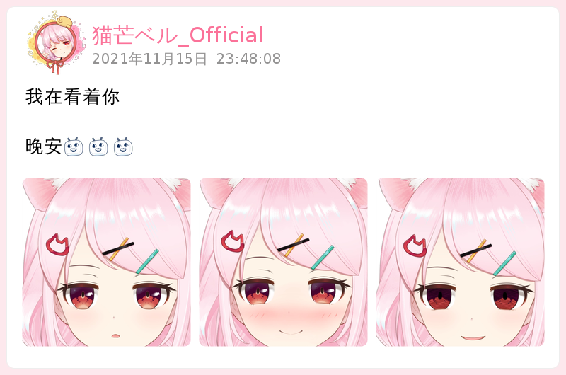
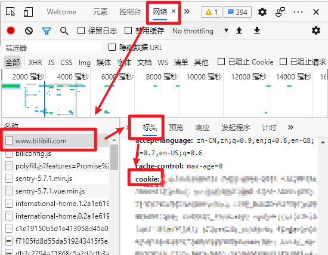

# BilibiliDynamic MiraiPlugin

> 一个把B站动态转发到Q群的 [Mirai](https://github.com/mamoe/mirai) 插件

## 简介    
低延迟检测B站动态(最低10s检测所有动态)    
使用Java原生Api绘图(~~selenium属实是不会用，老是崩~~)    
可以设定检测内容： 动态(包括视频)   仅视频   直播

与1.x版本数据不互通

#### 关于检测
通过检测 [动态](https://t.bilibili.com/) 界面，检测账号关注的所有最新动态，再挑选出QQ订阅的动态，这样一个检测周期就可以检测所有最新动态    
所以在QQ中的订阅就必须在b站账号中关注(插件有自动关注自动添加分组功能，推荐使用小号，详细见下文)

#### 关于自动关注(可关闭)
如果账号没有关注过此人，bot会自动关注并把他分到一个新分组中，方便管理    
是否开启自动关注以及新分组的名称都可以在config中配置    
如果关闭自动关注，那么在QQ中订阅一个未关注的人时会提示 未关注(如果你不想让bot自动关注又想检测动态，那么你可能不适合这个插件，请移步cssxsh大佬的[bilibili-helper](https://github.com/cssxsh/bilibili-helper))    

#### 关于分组(如果你不知道b站关注可以分组的话请忽略)
开启自动关注后，bot会生成一个新分组(分组名可以在配置中设置)，由bot新关注的人会被分到这个分组内，之前就关注过的不会移动    
如果你想让bot关注就保存在默认分组中，请在配置中替换 `followGroup` 后面的值为两个双引号 `""`

## 图片模式样式   
     

     

     

## 下载
下载插件本体: [releases](https://github.com/Colter23/bilibili-dynamic-mirai-plugin/releases)    
插件命令依赖 [在聊天环境执行指令](https://github.com/project-mirai/chat-command) 请确保有此插件

## 配置
  下面是一个配置文件模板   
  配置文件位于 根目录/config/BilibiliDynamic/BiliPluginConfig.yml  
  第一次运行插件会自动生成，也可自己创建  
  注：**后面的`cookie`为必填**
```yml
# 可以是群号或QQ号
admin: 11111111111

# 推送模式
# 0 :以文字形式推送
# 1 :以图片形式推送 (默认)
pushMode: 1

# 添加订阅时是否允许bot自动关注未关注的用户
# 开启 true
# 关闭 false
autoFollow: true

# Bot关注时保存的分组(最长16字符)
# 如果要保存到默认分组请填写为 ""
followGroup: Bot关注

# 检测间隔(推荐15-30 最低10) 单位秒 
# 不建议超过60，超过60可能会漏动态
interval: 15

# 图片推送模式用的字体
# 如不带后缀名则使用系统的字体，如系统中没有这个字体 则会使用系统默认字体
# 带后缀名则使用插件数据路径下 font 文件夹下的字体文件
# 如使用字体文件仅支持ttf格式
# 字体文件路径 data/BilibiliDynamic/font
# 需自行创建font文件夹，并把字体文件放进去
font: Microsoft Yahei

# cookie !!必填!!
# cookie请包在双引号内
# 如何获取见下文 获取Cookie
cookie: ""

# 百度翻译
baiduTranslate:
  # 是否开启百度翻译
  enable: false
  # 百度翻译api密钥 如需使用请自行申请
  # https://api.fanyi.baidu.com/
  APP_ID: ''
  SECURITY_KEY: ''
```
#### 获取Cookie
<details>
<summary>点击展开</summary>

浏览器打开B站 [BiliBili](https://www.bilibili.com/) 并登陆  
注：登陆后最好不要退出登陆

按`F12`，打开`开发者工具`，找到`Network 网络`并点击  
按`F5`刷新页面，按下图复制Cookie   


</details>

## 使用
插件命令依赖 [在聊天环境执行指令](https://github.com/project-mirai/chat-command) 请确保有此插件    
如果你不会给权限可以点击下面展开查看简略教程
<details>
<summary>点击展开</summary>

在控制台输入 `/perm add <许可人ID> top.colter.bilibili-dynamic-mirai-plugin:*`

其中的 `许可人ID` 如果你要让所有群所有人都可以用此插件就是 `*` 即 `/perm add * top.colter.bilibili-dynamic-mirai-plugin:*`    
具体的用户: `u123456789` 全部用户: `u*`    
具体的群: `g123456789` 全部群: `g*`    
更多的配置见 [被许可人 ID 字符串表示](https://github.com/mamoe/mirai-console/blob/master/docs/Permissions.md#%E5%AD%97%E7%AC%A6%E4%B8%B2%E8%A1%A8%E7%A4%BA)    
[授予一个用户执行所有指令的权限](https://github.com/mamoe/mirai-console/blob/master/docs/BuiltInCommands.md#%E6%8E%88%E4%BA%88%E4%B8%80%E4%B8%AA%E7%94%A8%E6%88%B7%E6%89%A7%E8%A1%8C%E6%89%80%E6%9C%89%E6%8C%87%E4%BB%A4%E7%9A%84%E6%9D%83%E9%99%90)

</details>

```
/bili <add 添加> <uid> [群/Q号]       #添加订阅
/bili <list 列表> [群/Q号]            #订阅列表
/bili <del 删除> <uid> [群/Q号]       #删除一个订阅订阅
/bili <delAll 删除全部订阅> [群/Q号]   #删除全部订阅
/bili <set 设置> <uid> [contact]      #设置订阅内容
/bili <color 颜色> <uid> <16进制颜色>  #设置图片推送主题色

[群/Q号] 不填的话默认对话所在地
<16进制颜色> 必须带#号 例: #fde8ed

下面是一些栗子:
/bili add 487550002    :为本群/好友添加uid为487550002的订阅
/bili add 487550002 111111  :为111111群/好友添加订阅
/bili color 487550002 #fde8ed  :设置主题色
```

## 已知问题
- 部分颜文字以及全部emoji都会以方块显示(正在寻找解决办法)
- 小概率图片模式有些文字或图片会错位
- 小概率图片获取失败，图片位置为全白
- 链接,话题以及@不会变色(感觉用处不大?如果你强烈需要可以去开个issues <_<)

## 其他
- 在 [DynamicPlugin](https://github.com/Colter23/bilibili-dynamic-mirai-plugin/tree/master/DynamicPlugin) 目录下有一个`font`文件夹里面有一个`思源黑体.ttf`  
  如没有字体使用可用这个

## 更新日志
[releases](https://github.com/Colter23/bilibili-dynamic-mirai-plugin/releases)

## 相关链接
[Mirai](https://github.com/mamoe/mirai)   
[ViViD按钮](https://vividbtn.top/)   
[B站: 猫芒ベル_Official](https://space.bilibili.com/487550002/) 这么可爱不关注一下吗(❁´◡`❁)    
[B站: Colter_null](https://space.bilibili.com/32868931) 如果github或论坛太长时间没回复可以去B站私信  

## 感谢
cssxsh: [bilibili-helper](https://github.com/cssxsh/bilibili-helper)


